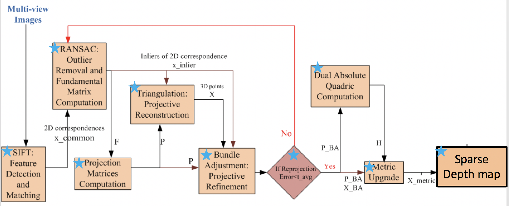

**README**

**Flow Chart:**

**Files**:

MSVC2010 solution file: 3DReconstruction.sln

**Header Files:**

    Common.h

**Source Files:**

    main.cpp - contains the main function

    CalcReProjErr.cpp - calcuates the error between the reprojection of calculated 3D points and keypoints detected

    computeSVD.cpp - Replacement for the OpenCV SVD calculation using LAPACK libraries from MKL package 

    depcomposeProjection.cpp - Replacement of OpenCV decomposeProjectionMatrix() using LAPACK libraries from MKL package

    displaymatches.cpp - Produces a single image showing matching keypoints in multiple views

    findcommon.cpp - Finds the common points for triangulation from all 8 views

    FindHfromQ.cpp - Decomposes Q matrix to find H 

    fundamentalmartix.cpp - Replacement of OPENCV findFundamentalMat()

    getkeypoints.cpp - Computes SIFT keypoints and corresponding descriptors for an image

    imageload.cpp - loads images, the path to the images to be loaded

    matchdesciptors.cpp - Matches Keypoints from each image pair using their descriptors

    MetricUpgrade.cpp - Metric Upgrade using the sparsePOP function. 
	    
        Requires: sparsePOP.exe, param.pop, param.sdpa, for execution (included in the folder)
	    
        Input File: MetricUpgradeRef.gms (included)
	    
        Output File: MetricUpgrageOut.txt
	    
        URL: http://www.is.titech.ac.jp/~kojima/SparsePOP/
	    
        Library Depndency: SymbolicC++ (3rdParty folder)

    projectionmatrix.cpp - Computes projection matrix from Fundamental matrix

    RANSAC.cpp - Implements RANSAC for use in computing fundamental matrix    

    refinepoints.cpp - Normalizes matched keypoints

    SBA.cpp - Bundle Adjustment using the 3rd party SBA libraries. 
	
    sift_new.cpp - Implements a SIFT Keypoint detector using VLFeat library package 

        URL: http://www.vlfeat.org/
	
        Library Depndency: vlfeat (3rdParty folder)
	
    triangulation.cpp - Computes 3D points from provided set of 2D points using triangulation

**3rdParty:**

    SBA (ver 1.5) - http://users.ics.forth.gr/~lourakis/sba/ 
    SymbolicC++ - http://issc.uj.ac.za/symbolic/symbolic.html
    vlfeat - Vision Lab Features Library (SIFT), http://www.vlfeat.org/api/index.html

**Issues:**
1. sparsePOP is provided as an application (.exe) and hence is run on a child process. Compiling instructions require cross compilation from Linux environment.
2. SymbolicC++ libraries required by sparsePOP to form the optimization equation is slow and needs to be substituted with faster options.
